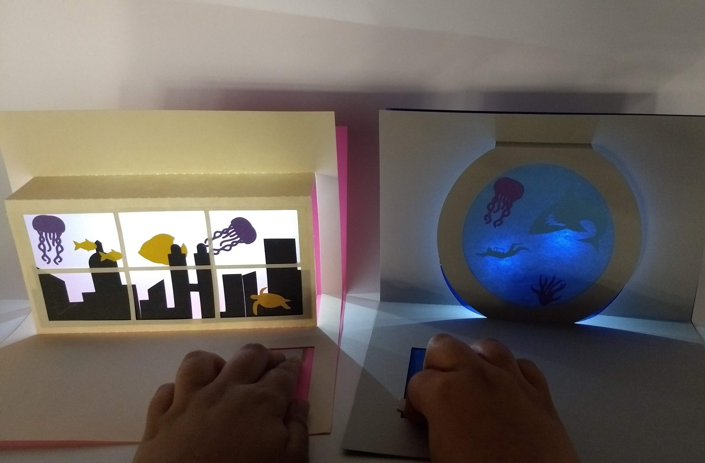
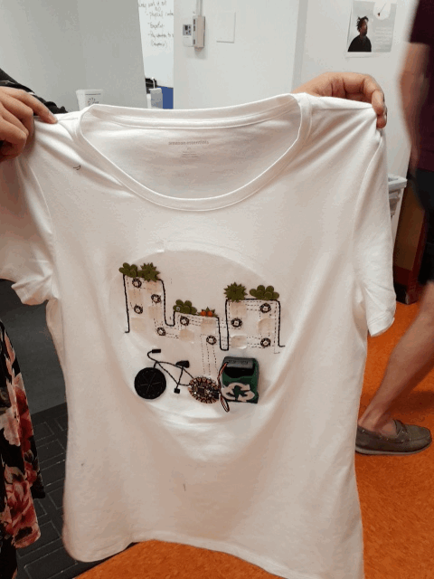
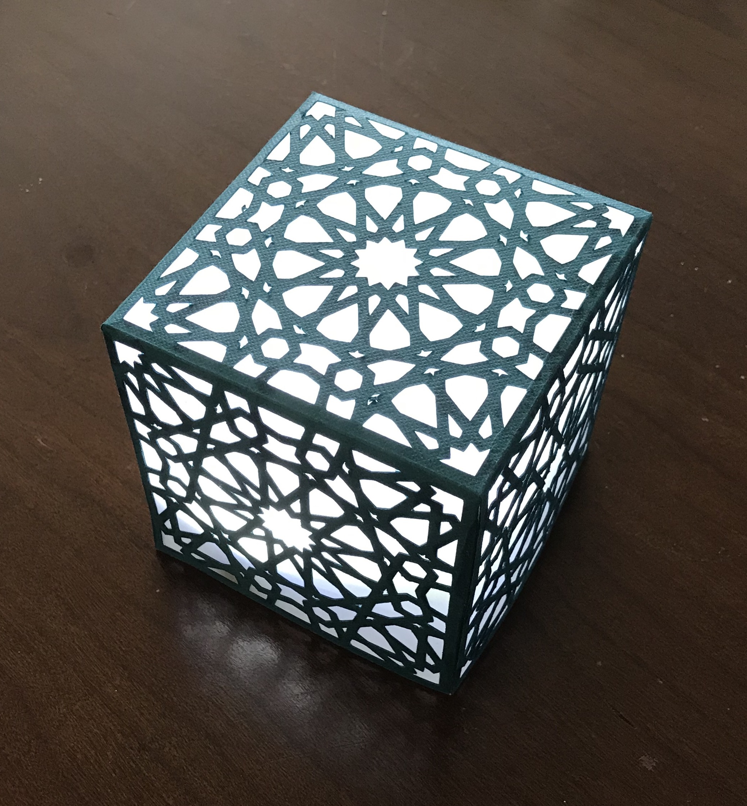
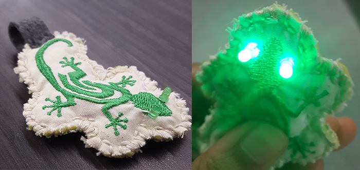
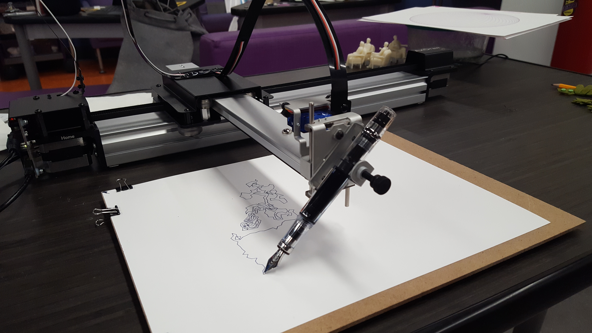
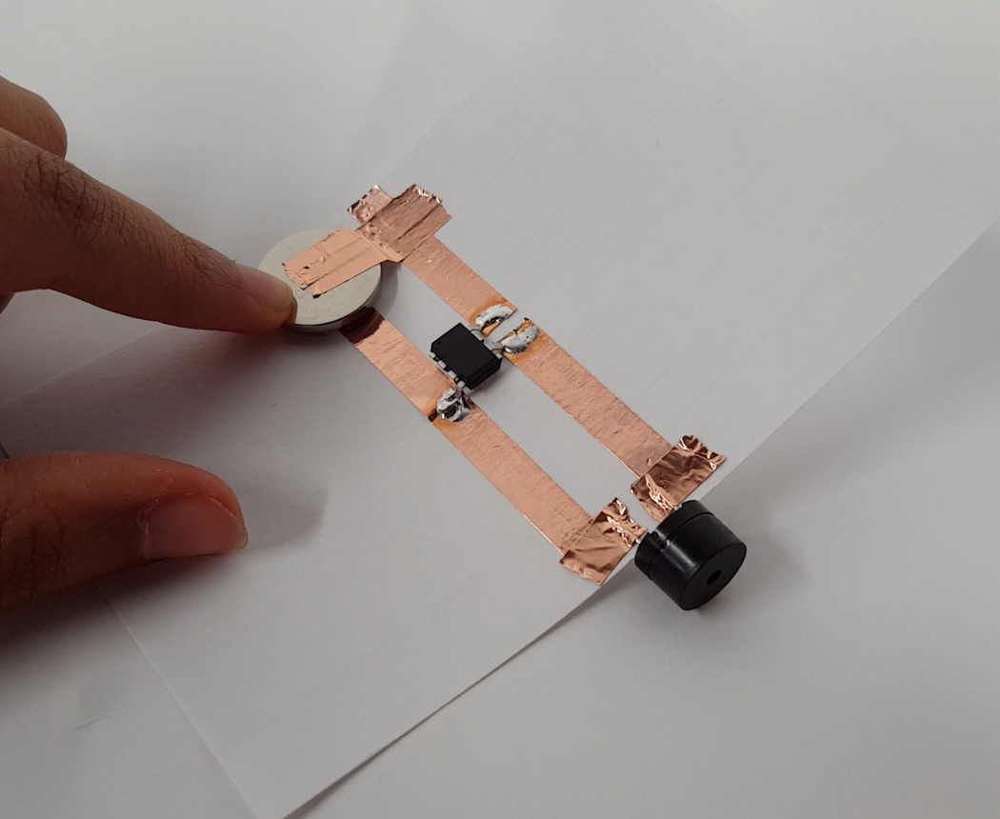

I spent this summer working at the [Studio Lab](https://cst.princeton.edu/studiolab) at Princeton University. I got involved with Studio Lab in my senior year and loved it so much that I jumped at the chance to explore further post-graduation. In this post, I'll try to recap some of the projects I worked on.

## Workshops

### Pop-Up Cards for Librarians

We designed and led a workshop teaching some Princeton librarians and library staff how to make light-up pop-up cards. We designed the card templates in Adobe Illustrator and precut the cards and decorations with a Silhouette Cameo vinyl/paper cutter. The circuits were made with copper tape and Chibitronics LED stickers.

### Circuitry and Coding for PUMA

We taught high school students about circuitry and code through wearable electronics. Most of our work was designing and leading workshops for them—we started with rapid prototyping but quickly moved on to color theory, paper and fabric circuits, and coding in Arduino. As their final project, they were asked to design T-shirts in small groups. As part of our preparation for the project, fellow intern Cynthia and I designed our own light-up T-shirt. It uses the Adafruit Flora and color-changing neopixels, and is themed around sustainable cities.

## Assorted Tech Tinkering

### Paper Lantern

This project was a quick one, while I was learning about Girih and trying to see how complex of a design I could get with the paper cutter.

### Embroidery Machine

One of the new technologies the space got this summer was an embroidery machine. I got to be the first one to play with it, and one of my projects was a light-up lizard keychain.

### AxiDraw Pen Plotter

This is probably my favorite of the Studio Lab technologies. As an avid doodler and fountain pen enthusiast, I fell in love with the [AxiDraw](https://www.axidraw.com/) immediately. It makes adorable noises and can produce some really beautiful, precise drawings and lettering.

### Bite-sized circuits with the ATTiny

Here is a tiny circuit I put together that plays Happy Birthday when you push on the battery. The ATTiny(85) is really nice to use because it's quite affordable and small enough to fit into mini projects. It's not too hard to program, either (check out our [github examples](https://github.com/shefalinayak/attiny-examples)).

