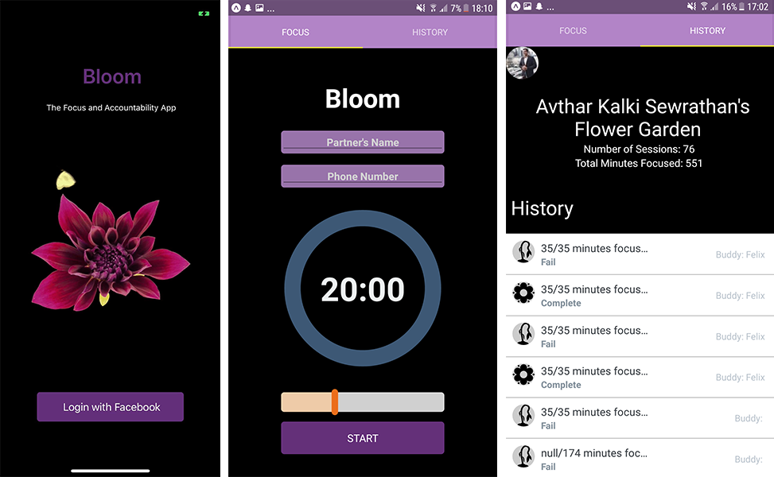
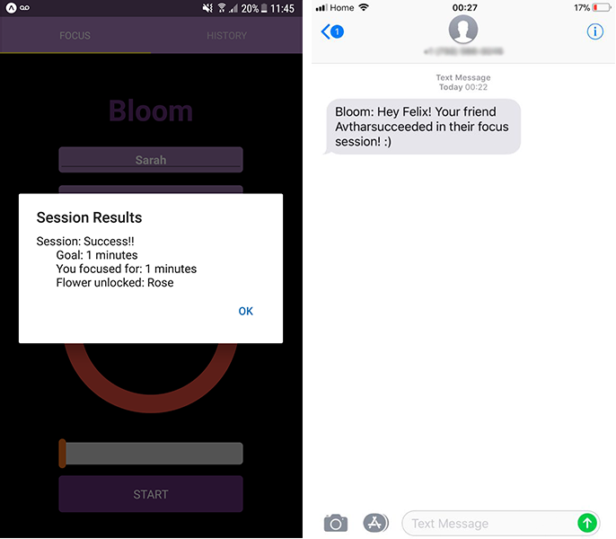

Bloom is a mobile app that helps friends keep each other accountable during focus sessions. We were looking for a friendly way for friends to encourage each other to stay off their phones. Users use the app for focus sessions—if they choose to focus for 20 minutes, they need to stay off their phone for 20 minutes after they start the timer. Successful sessions earn flowers, so users gather "gardens" through regular focus.

When a user begins a session, they must specify an accountability buddy of their choice. That friend will later be informed of their success or failure.

This was a group project for a computer science class, where the goal was to create a three-tier web/mobile application in a few weeks. My main role was backend engineering: designing and implementing the server and database, as well as creating the API for app-server communication.
