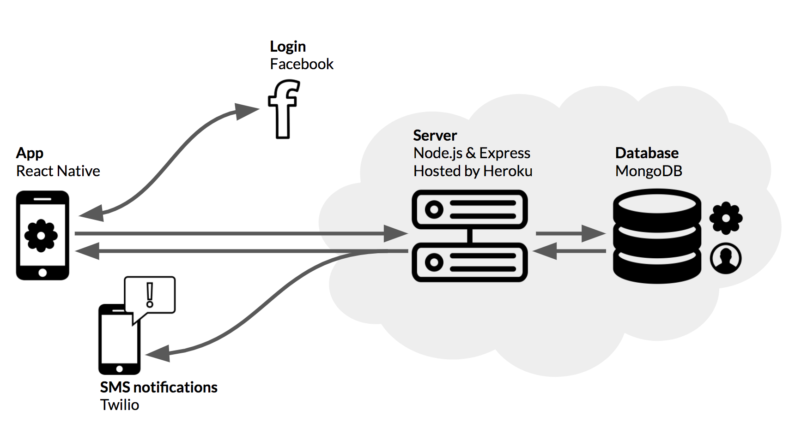
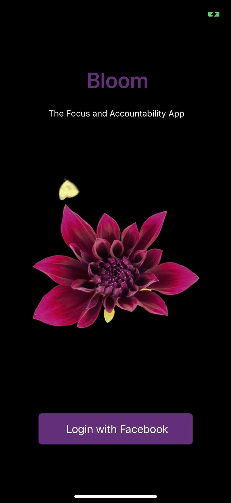

Bloom is a mobile app that helps friends keep each other accountable during focus sessions. We were looking for a friendly way for friends to encourage each other to stay off their phones. If a user begins a session, an accountability buddy of their choice will later be informed of their success or failure. Successful sessions earn flowers, so users gather "gardens" through regular focus.

