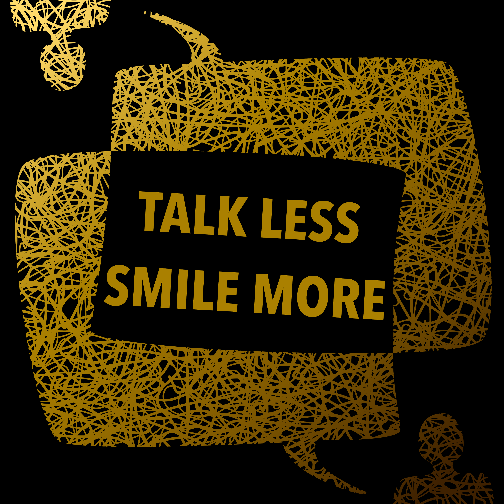

These are projects I've worked on where I'm not the main creator. I know some cool people doing some cool things and sometimes I can't help but get involved.

## Synthesine

[Synthesine](https://aatishb.com/synthesine/) is a web playground for synthesizing sound waves from scratch, developed by Aatish Bhatiya. There's a live editor so you can play with waveforms and synthesize sounds in a functional programming setting and see/hear the results in real time. It's very cool—there are a lot of examples, ranging from simple sine waves to more complex flutes and glass clinking, and every example can be experimented with. I contributed to the UI/design, aiming to make it more responsive and beginner-friendly.

## Talk Less Smile More

[Talk Less Smile More](https://soundcloud.com/user-976453551) is a podcast about living with mental illness by Dalia Berkowitz and Christopher Hylwa. I designed the graphics (podcast artwork, user icon, Facebook banner). The short version of idea behind the design is that brains are messy, but talking to other people can bring clarity and understanding. The color scheme is themed after Hamilton, because Dalia loves Hamilton and all the episode titles were taken from lines from the musical.

