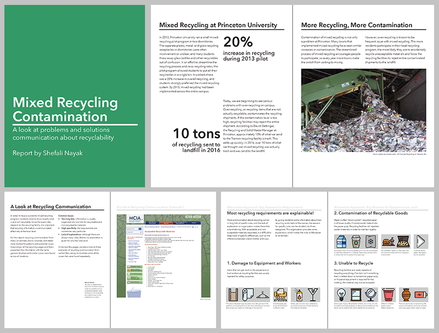
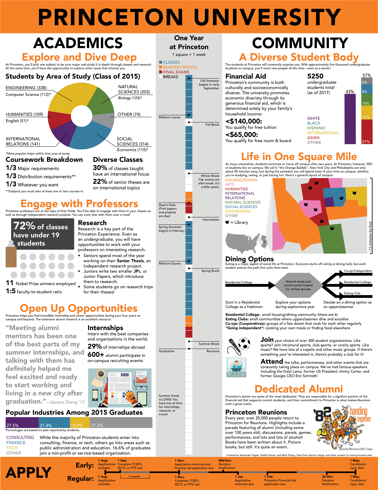
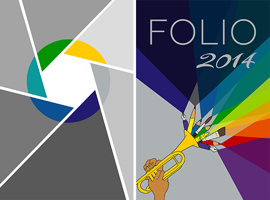

Here is some of my graphic design work.

## Information Design

I'm particularly interested in information design and data visualization. Generally, design that focuses on presenting information clearly without being confusing or overwhelming.

### Mixed Recycling Report

This report, made for a class, looks at mixed recycling contamination at Princeton and presents a way to explain the various rules to make them easier for people to remember. This was an information design project but also involved research and communication with the Office of Sustainability. The report is private due to some confidential information discussed, but below is a preview of some of the spreads.

### Intro to Princeton for International Applicants

This was created for a class project. The goal is to describe Princeton University to a prospective international student, including courses, majors, campus life, and the application process. Looking back, the design needs much more room to breathe, since the jam-packed information can be overwhelming and hard to navigate. But as part of the final evaluation our projects were shown to a group of Kenyan students, who said that among the class's posters, this was the one they found most interesting and learned the most from.

## Graphic Design

### Podcast artwork

Logo/profile/banner design for a friend's podcast. More information [here](/pages/projects/collabs/post/).

### Folio Literary Magazine

An old project (from high school)—this was the cover art (back,front) for an arts and literary magazine that we published annually. We always had a lot of photography, hence the aperture design on the back, and we organized two coffee house events every year with music, hence the trumpet.

