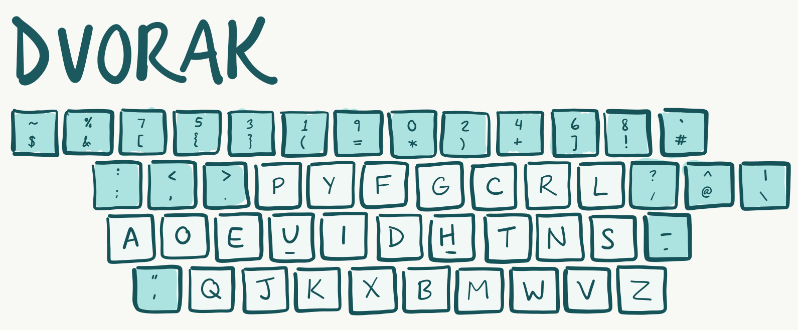

I _finally_ rebuilt my website!

I've learned a lot since I first put together a personal site in January 2017. The original thing was cobbled together in simple HTML and CSS, with a splash of javascript thrown in for effect. That wasn't too bad, so then I tried to use Jekyll to make a blog section.

##My trials with Jekyll
