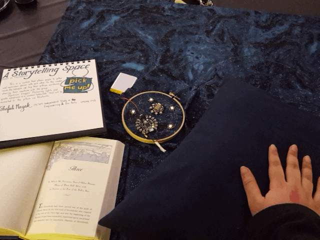

This project was an independent study I did during my senior year at Princeton. I've always loved storytelling and I wanted to make something that enhanced the group experience of it. The piece consists of pillows that listeners can squeeze when they feel excited or want to react to something in the story. The pillows trigger vibrations and rustling on a centerpiece that acts something like a smart indoor fireplace.

Early stages of the project were taken to Mercer Bucks Mini Maker Faire in Pennington and to the Living at the Intersection Symposium at Princeton University.

## Concept

I was inspired by a chapter on analog gaming from the book _Revenge of the Analog_, and in particular a passage about why people play board game that really resonated with me:

> “With analog gaming, whether it is an intricate board game or a child’s game of tag, all the players need to work together to create the illusion of the game. It requires a collective investment of your imagination in an alternate reality to believe that you actually own Par Avenue, and the colored slips of paper in your hands are worth something. When that happens in gameplay, it triggers what De Koven calls coliberation. “When we’re together in a social space environment, we each kind of free the other to be more complete, more full, more yourself,” De Koven said. In effect, we work together to liberate one another from reality." —David Sax, _Revenge of the Analog_

It made me think about reading stories together and the same value that has, and I wanted to create something that spoke to that.

<!-- ## Process

My advisors (the wonderful Sharon De La Cruz and David Bengali) recommended proposing something I didn't know how to make yet, and so I started this sewing and circuitry project with little knowledge of electronics or sewing machines. I began making -->

