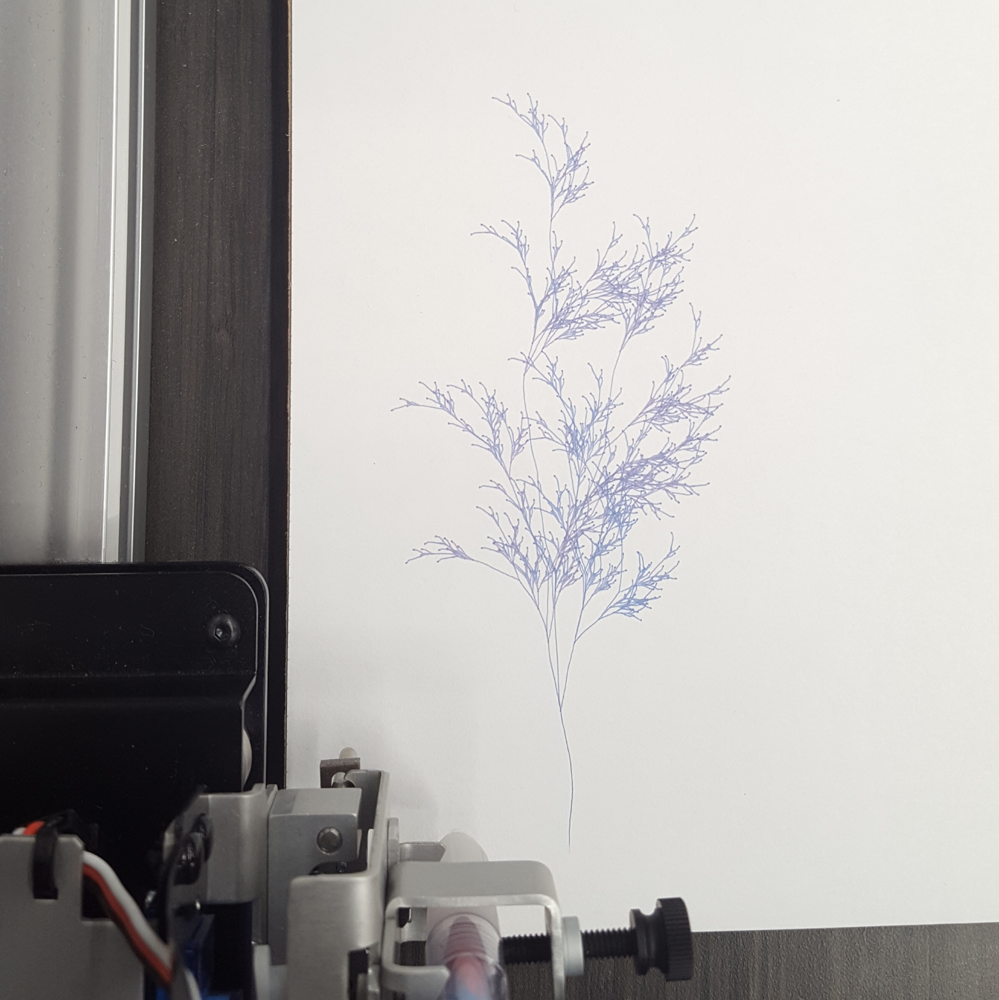
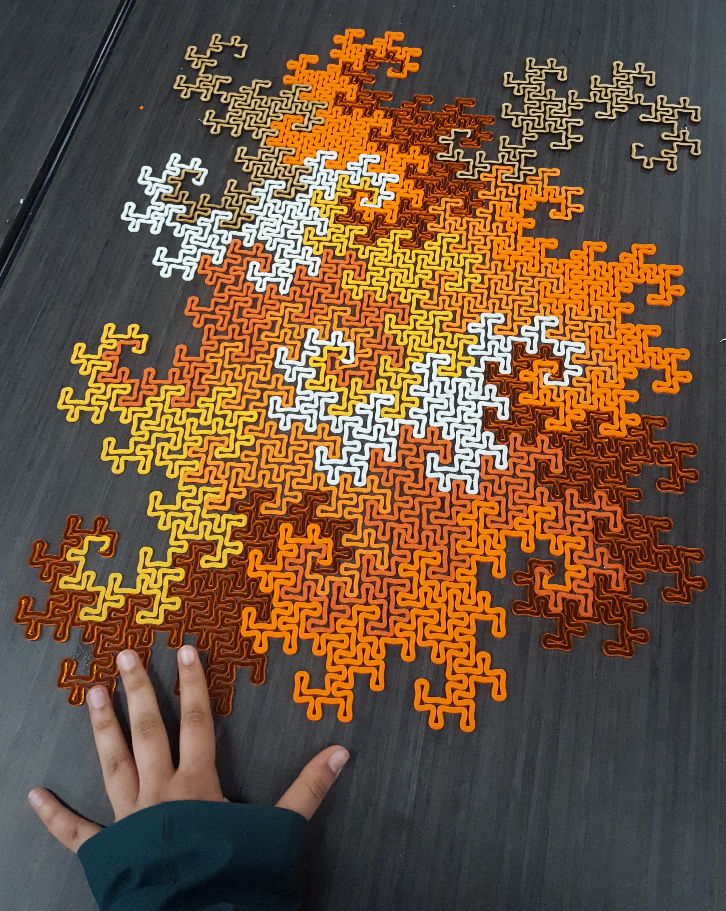

## [Link to the project](https://shefalinayak.github.io/svg-generators/)

You can use the SVG generators to make things with pen plotters, laser-cutters, and other prototyping tools. Some examples below:

### Trees

### Dragon Curves

They tile the plane! These ones are made of felt, acrylic, and wood:

