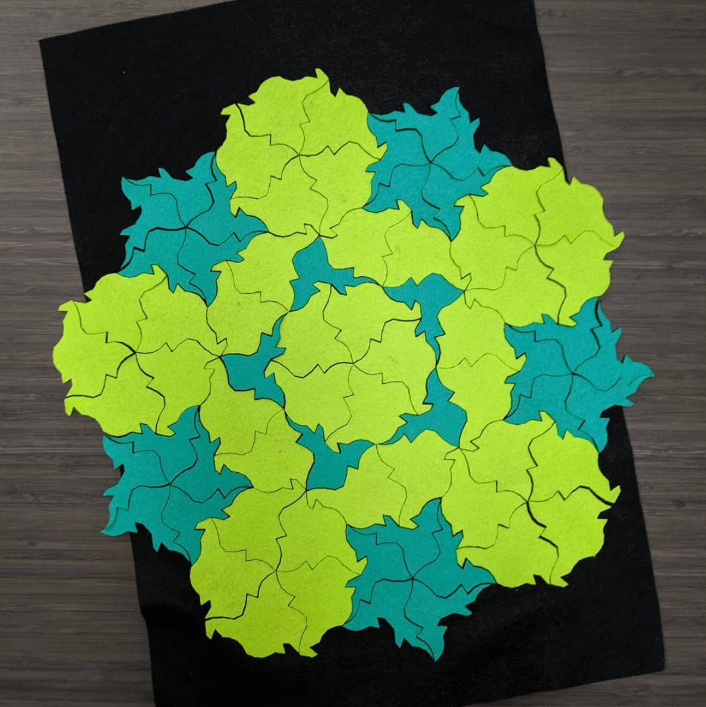

## [Link to the project](https://shefalinayak.github.io/tile-playground/)

### You can use the Tile Playground to make real-life stuff!

Here are some tiles I designed, based on the Penrose kite and dart tiling, then laser-cut out of felt:

## You are a designer of infinite courtyards

You are a designer in the business of making infinite courtyards. You lay out tiles in a special, world-renowned method called **Tessellation**. Your method has a few simple rules:

1. You have a **limited number of shapes.** This is an infinite courtyard; you can't tile the entire thing yourself! You need to make a set of 2D templates so that you can move on to more exciting things while your army of robots makes the tiles and lays them out.
2. The courtyard must be perfectly flat. That means **no gaps** that weeds might grow through, and **no overlaps** that people might trip over.

The hard part, of course, is designing the tiles. You used to make simple shapes, like squares and triangles, but lately your clients have become more demanding. *This tool is for you!*

(proper explainer in progress)
