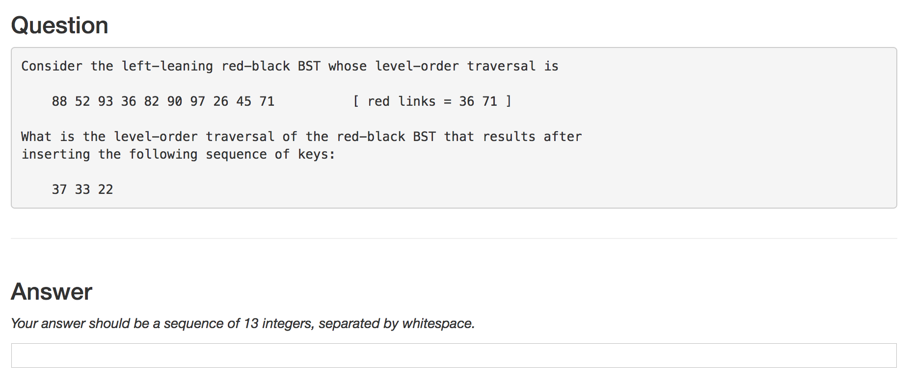
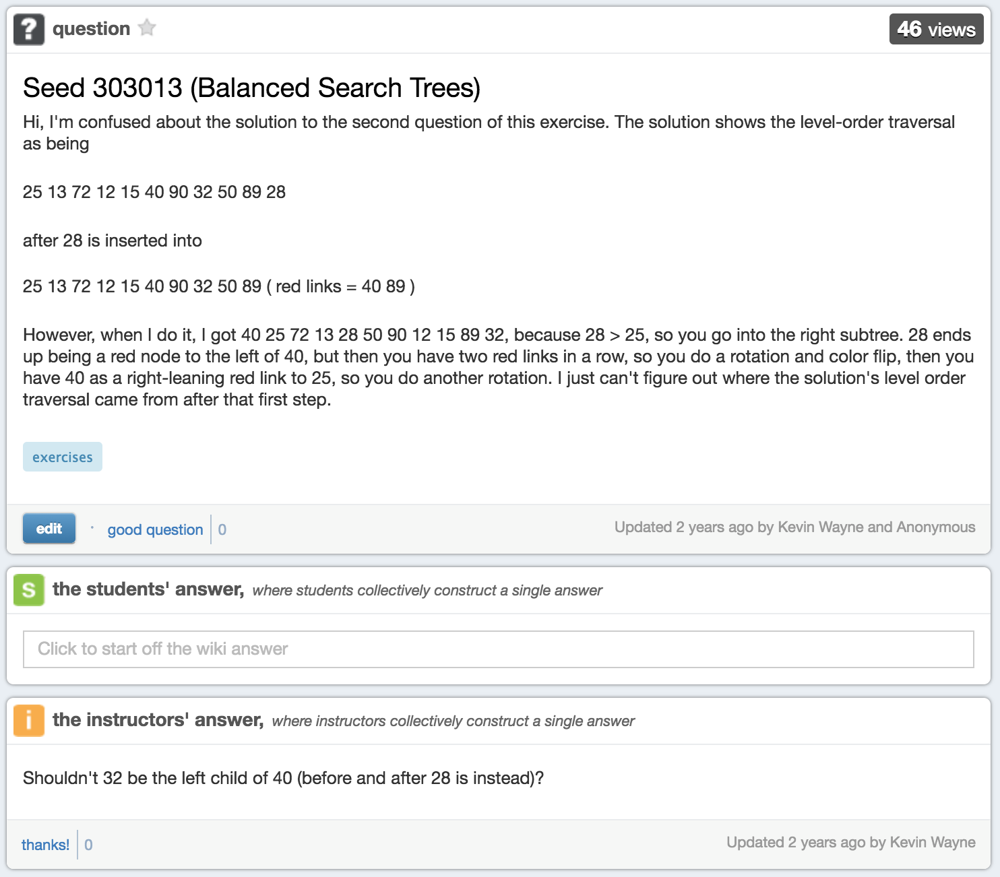
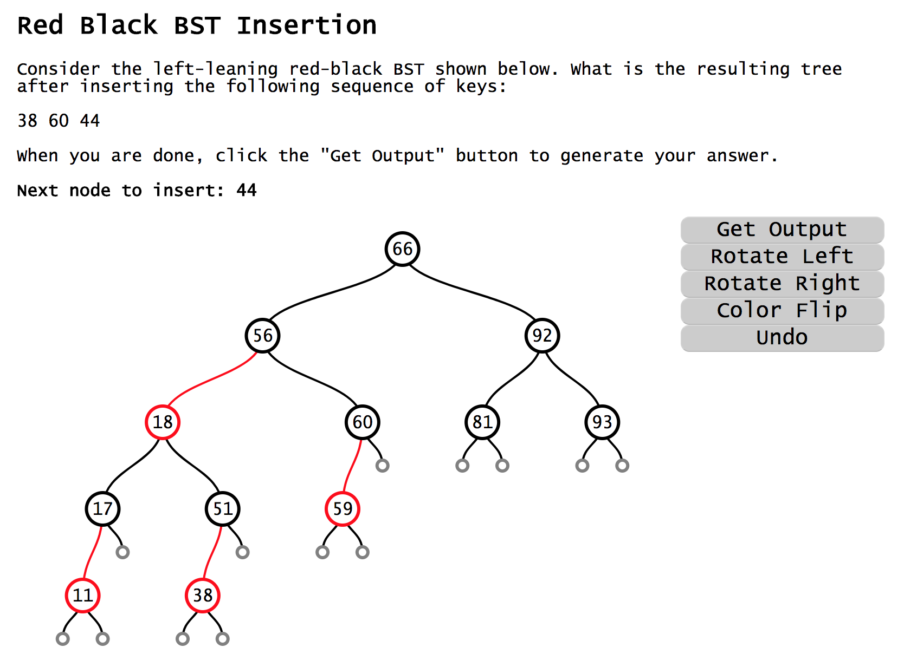

## [Link to the project demo](http://shefalinayak.com/visualquizzing/app/)

Visual Quizzing is a new approach to online quizzing modules used by the Princeton Computer Science Department. The questions are from a course about algorithms and data structures. The existing question format is largely text-based and not particularly intuitive, often leading to unnecessary errors, especially since there isn't a good way to discuss these questions online.

 The new visual and interactive versions of some question modules are an opportunity to help students practice and really understand hierarchical data structures. The modules can also be used during classes or lectures to explain the algorithms.

